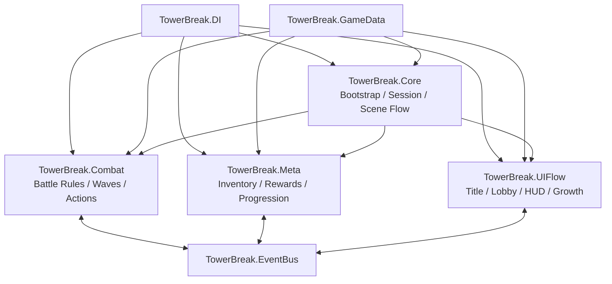
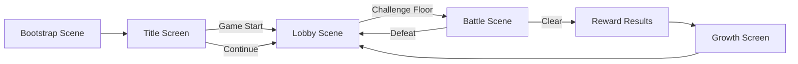
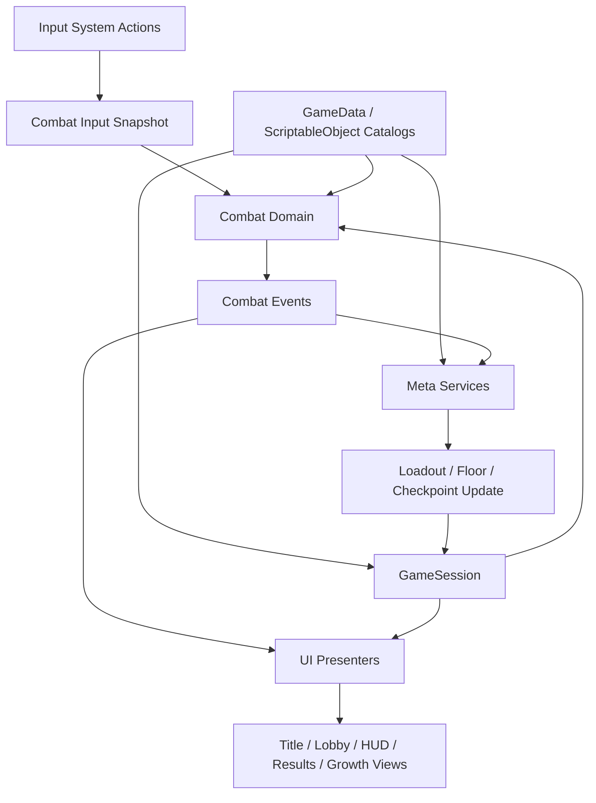

# Tower Breaker Vertical Slice Architecture

## 1. Document purpose

This document defines the target runtime architecture for the first playable vertical slice of `Tower Breaker`.

It is derived from:
- `docs/Direction/기획서.md`
- `docs/Direction/2026-03-13-tower-breaker-storyboard.md`
- `docs/plans/2026-03-13-tower-breaker-vertical-slice/00-overview.md`
- `docs/plans/2026-03-13-tower-breaker-vertical-slice/01-foundation-and-bootstrap.md`
- `docs/plans/2026-03-13-tower-breaker-vertical-slice/02-combat-loop.md`
- `docs/plans/2026-03-13-tower-breaker-vertical-slice/03-meta-progression.md`
- `docs/plans/2026-03-13-tower-breaker-vertical-slice/04-ui-flow-and-content.md`
- `docs/plans/2026-03-13-tower-breaker-vertical-slice/05-integration-and-verification.md`

The goal of this architecture is to support one complete loop:
`Title -> Lobby -> Battle -> Reward -> Growth -> Next Floor`

The architecture favors:
- small runtime modules
- deterministic rule logic in plain C#
- Unity scene/prefab code only where lifecycle or presentation is required
- explicit dependency wiring through the existing `DI` module
- decoupled gameplay notifications through the existing `EventBus` module
- tunable content through `GameData` and `ScriptableObject` assets

## 2. Architectural goals

### Functional goals

- support the 3-button combat loop: `Attack`, `Dash`, `Guard`
- support the lane-pushing battle rule where enemies push left and the player recovers space to the right
- support wall collision HP loss and danger-state recovery
- support floor clear rewards, inventory updates, equipment management, reroll, enhancement, and checkpoint progression
- support smooth scene flow from title to lobby to battle and back

### Quality goals

- keep combat rules testable without loading Unity scenes
- keep progression rules testable without UI objects
- prevent cross-feature tight coupling between battle, meta, and UI
- keep data-driven tuning possible for floors, weapons, enemies, and rewards
- keep the first slice small enough to extend to additional floors later without architectural rewrite

## 3. High-level system view

The vertical slice is composed of four gameplay modules on top of existing shared modules.

### System graph



### Existing shared modules

- `TowerBreak.DI`
  - registers application and scene-scoped services
  - resolves runtime dependencies explicitly
- `TowerBreak.EventBus`
  - publishes and subscribes typed gameplay events
  - keeps unrelated systems from directly depending on each other
- `TowerBreak.GameData`
  - provides asset-backed definitions and future import pipeline support
  - stores tunable data for floors, enemies, rewards, and weapons

### New gameplay modules

- `TowerBreak.Core`
  - bootstrap, session state, scene transitions, shared contracts
- `TowerBreak.Combat`
  - battle simulation, player actions, wave progression, combat outcomes
- `TowerBreak.Meta`
  - inventory, equipment, wallet, reroll, enhancement, progression, checkpoints
- `TowerBreak.UIFlow`
  - title, lobby, HUD, reward, and growth presentation logic

## 4. Module responsibilities and boundaries

### 4.1 `TowerBreak.Core`

`Core` is the application spine of the slice.

Responsibilities:
- initialize the game once in `Bootstrap`
- create and own `GameSession`
- hold current run context such as current floor, checkpoint, equipped weapon snapshot, and pending rewards
- route scene transitions through a dedicated scene flow service
- expose input normalization and shared state contracts

Must not:
- own detailed combat rules
- own inventory mutation rules
- query UI widgets directly

Representative types:
- `GameBootstrap`
- `GameSession`
- `SceneFlowService`
- `FloorProgressState`
- `PlayerLoadoutState`
- `RunContext`

### 4.2 `TowerBreak.Combat`

`Combat` owns the battle simulation.

Responsibilities:
- maintain battle state and lane pressure state
- resolve player input into combat actions
- apply weapon archetype behavior such as `Claw` and `Lance`
- spawn and pace enemy waves from floor definitions
- manage demonization gauge and temporary power spike
- emit clear/defeat/combat state events

Must not:
- modify inventory directly
- load scenes directly
- read UI components as part of rule execution

Representative types:
- `BattleState`
- `PlayerActionResolver`
- `AttackResolutionService`
- `WaveDirector`
- `DemonizationService`
- `BattleLoopController`

### 4.3 `TowerBreak.Meta`

`Meta` owns persistent and semi-persistent growth state.

Responsibilities:
- manage wallet and inventory state
- resolve battle rewards from floor and reward definitions
- compare, equip, enhance, dismantle, and reroll equipment
- update floor progression and checkpoint state
- persist run progress locally for continue/retry flows

Must not:
- run battle simulation
- own direct scene transition logic
- manipulate presentation-only objects

Representative types:
- `PlayerInventoryState`
- `PlayerWalletState`
- `RewardResolver`
- `BattleRewardService`
- `EquipmentEnhancementService`
- `EquipmentRerollService`
- `FloorProgressionService`
- `LocalRunPersistence`

### 4.4 `TowerBreak.UIFlow`

`UIFlow` owns presentation and user navigation inside each scene.

Responsibilities:
- render title, lobby, battle HUD, results, and growth screens
- subscribe to application/gameplay state and project it into widgets
- forward user actions to application or domain services
- show state transitions such as danger warning, rewards, and current objective

Must not:
- contain the source of truth for game rules
- calculate rewards or equipment changes internally
- act as a service locator over the whole game

Representative types:
- `TitleScreenPresenter`
- `LobbyPresenter`
- `BattleHudPresenter`
- `RewardResultsPresenter`
- `GrowthScreenPresenter`

## 5. Scene architecture

The slice uses three scenes with clear roles.

### Scene flow graph



### `Assets/Scenes/Bootstrap.unity`

Responsibilities:
- initialize shared services once
- create the root DI registration
- restore continue data if available
- route first navigation to title or lobby

Contents should stay minimal:
- bootstrap root object
- `CoreInstaller`
- input bootstrap if needed

### `Assets/Scenes/Lobby.unity`

Responsibilities:
- present current progression state
- show currencies, power, equipped weapon, and target floor
- host equipment, enhancement, reroll, and challenge entry UI

Scene-scoped services:
- `LobbyInstaller`
- lobby presenters and view binders

### `Assets/Scenes/Battle.unity`

Responsibilities:
- run the battle simulation
- host battle HUD and enemy/player presenters
- publish outcome and hand off results back to progression flow

Scene-scoped services:
- `BattleInstaller`
- `BattleLoopController`
- combat presenters and HUD binding

## 6. Composition model: DI and EventBus

### DI usage

The existing `DIContainer` is the primary composition mechanism.

Rules:
- bootstrap registers application/session-scoped services once
- each gameplay scene registers scene-local presenters/controllers through a scene installer
- services should depend on abstractions or narrow concrete collaborators, not broad global access
- `GameSession` may be shared state, but it must not become a generic service locator

Recommended scopes:
- app/session scope: `GameSession`, `SceneFlowService`, persistence adapter, shared catalogs
- battle scope: battle controller, wave director adapter, HUD presenter, combat presenters
- lobby scope: lobby presenter, growth presenters, equipment list presenters

### EventBus usage

The existing `EventBus<T>` is the preferred communication path for cross-module notifications.

Recommended events:
- `FloorStartedEvent`
- `FloorClearedEvent`
- `PlayerDefeatedEvent`
- `RewardsGrantedEvent`
- `DemonizationStartedEvent`
- `DemonizationEndedEvent`

Rules:
- publish events when state transitions matter to another module
- do not use EventBus as a request/response service locator
- prefer direct method calls inside a cohesive module; use events for cross-module decoupling

## 7. Runtime data model

The system distinguishes between three kinds of data.

### 7.1 Static authored data

Stored in `GameData` or `ScriptableObject` assets.

Examples:
- floor definitions
- enemy definitions
- weapon definitions
- reward tables
- reroll cost policies

Properties:
- authored in editor
- read-only during runtime flow
- safe to reference from multiple systems

### 7.2 Session state

Stored in `GameSession` and closely related state objects.

Examples:
- current selected floor
- last unlocked checkpoint
- equipped weapon snapshot
- pending reward bundle
- continue availability

Properties:
- survives scene changes during one app session
- may be serialized for continue support

### 7.3 Battle state

Stored only while a battle is running.

Examples:
- lane position
- player hearts
- spawned enemies and their combat stats
- demonization gauge
- current wave progress

Properties:
- created on battle entry
- disposed on battle exit
- should be reconstructable from session state plus floor data

## 8. Core runtime flows

### Runtime data flow graph



### 8.1 Start flow

1. `Bootstrap` scene loads.
2. `GameBootstrap` creates root services and session state.
3. continue data is checked through persistence service.
4. title UI is shown.
5. user selects `Game Start` or `Continue`.
6. scene flow moves to lobby with the correct progression state.

### 8.2 Lobby to battle flow

1. lobby presenters read `GameSession` and meta services.
2. current floor target, equipment summary, and power are rendered.
3. player optionally changes weapon, rerolls, or enhances gear.
4. lobby issues a challenge request.
5. `SceneFlowService` loads `Battle.unity`.
6. battle installer creates battle-scope services from floor data and current loadout.

### 8.3 Battle simulation flow

1. normalized input enters combat through a facade or snapshot.
2. player action resolver chooses the current combat action.
3. battle state updates lane pressure, attacks, enemy pushes, and heart loss.
4. wave director injects enemy spawns based on floor definition.
5. demonization gauge fills from kills and may activate a timed buff.
6. battle ends in clear or defeat.
7. outcome event is published.

### 8.4 Reward and growth flow

1. on clear, reward resolver computes the reward bundle.
2. reward service applies wallet and inventory changes.
3. results UI displays gained resources and equipment.
4. growth UI allows equip, enhance, dismantle, or reroll actions.
5. updated loadout is written back to session state.
6. lobby reopens or next battle is started.

### 8.5 Defeat and checkpoint flow

1. defeat event is published from combat.
2. progression service resolves retry target.
3. if current run has passed a checkpoint, retry starts from that checkpoint floor.
4. otherwise retry starts from the current allowed floor baseline.
5. title `Continue` and lobby state read from persisted run data.

## 9. Input architecture

The project already includes `Assets/InputSystem_Actions.inputactions`.

Architecture rules:
- reuse the existing input asset
- expose a normalized combat-facing interface instead of binding combat logic directly to raw Input System callbacks
- separate player combat inputs from UI navigation inputs

Combat-facing snapshot shape:
- `AttackHeld`
- `DashPressed`
- `GuardPressed`

This keeps combat rules deterministic and easy to test.

## 10. Combat architecture details

Combat is intentionally split into two layers.

### 10.1 Domain layer

Plain C# logic with no required Unity scene dependency.

Contains:
- state objects
- action resolution
- attack resolution
- wave timing rules
- enemy behavior abstractions
- demonization rules

This layer is the source of truth for battle behavior and should own:
- line push calculations
- wall collision HP penalty
- action gating during danger state
- weapon archetype effect calculations

### 10.2 Presentation adapter layer

Unity-specific scene objects that mirror domain state.

Contains:
- `BattleLoopController`
- player/enemy presenters
- animation and FX bridges
- HUD presenter bindings

This layer should:
- call into the domain layer with time/input
- reflect resulting state into transforms, bars, labels, and animation triggers
- stay thin and disposable

## 11. Meta progression architecture details

Meta progression should be service-oriented, not scene-oriented.

### Inventory and wallet

Own:
- currencies
- owned equipment list
- equipped item reference
- pending rewards after combat

### Equipment pipeline

Operations:
- compare
- equip
- enhance
- dismantle
- reroll

Constraints:
- weapon identity is preserved across reroll
- variable stats are rerolled, not archetype or rarity identity
- enhancement consumes materials and modifies combat-facing stats

### Progression pipeline

Own:
- current floor
- highest cleared floor
- last checkpoint
- continue save payload

Checkpoint policy for the slice:
- floors `1-10` are in scope
- checkpoint update occurs at floor `10`
- defeat resumes from last unlocked checkpoint when available

## 12. UI architecture details

UI should follow a presenter/view split.

### View responsibilities

- hold serialized references to buttons, labels, images, and layout containers
- expose narrow methods like `SetGold`, `SetHeartCount`, `SetWeaponSummary`
- contain no business rules

### Presenter responsibilities

- subscribe to session state or events
- translate domain data into UI-friendly strings and lists
- handle button interaction routing
- refresh views after progression or battle events

Scene mappings:
- title scene UI: title presenter/view
- lobby UI: lobby presenter plus growth/equipment presenters
- battle UI: HUD presenter, danger banner presenter, gauge presenter
- results UI: reward presenter and growth presenter

## 13. Testing architecture

The architecture depends on layered tests.

### EditMode rule tests

Primary coverage should target pure logic.

Examples:
- lane pressure and wall penalty rules
- input-to-action translation
- weapon archetype behavior
- reward resolution
- reroll and enhancement rules
- checkpoint updates and retry policy

### EditMode integration tests

Focused integration tests should validate:
- DI registration and scene installer scoping
- application flow transitions
- reward visibility after returning to lobby
- continue availability and save restoration

### Unity scene/manual verification

Manual smoke verification should confirm:
- title to lobby to battle flow
- HUD updates under danger state
- rewards appear after clear
- growth changes affect the next battle
- checkpoint resume behavior works

## 14. Boundary rules and anti-patterns

To keep the slice maintainable, do not do the following:

- do not place combat rules inside `MonoBehaviour` presentation components
- do not let UI widgets directly mutate inventory or battle state without a service/presenter boundary
- do not use `EventBus` as a general-purpose service locator
- do not let runtime gameplay assemblies depend on editor-only code
- do not put progression persistence logic inside UI presenters
- do not bypass `GameSession` with ad-hoc static globals

## 15. Recommended folder layout

```text
Assets/
  Scripts/
    Core/
      Application/
      Data/
      Events/
      Input/
      State/
    Combat/
      Domain/
      Events/
      Presentation/
    Meta/
      Equipment/
      Events/
      Progression/
      Rewards/
      State/
    UIFlow/
      Battle/
      Growth/
      Lobby/
      Results/
      Title/
  Scenes/
    Bootstrap.unity
    Lobby.unity
    Battle.unity
  Prefabs/
    Combat/
    UI/
  Data/
    GameData/
```

## 16. Extension path after the first slice

This architecture is intentionally sized for the first slice, but it should extend cleanly to:
- additional floors beyond `10`
- floor `10` boss logic
- richer enemy archetypes and telegraphed behaviors
- stronger save/checkpoint UX
- broader `GameData` import automation for content pipelines

The key extension rule is simple: add content and isolated services first, and only widen module boundaries if repeated concrete pressure proves the current seams are insufficient.

## 17. Summary

The target architecture treats `Tower Breaker` as a small composition of:
- `Core` for app/session flow
- `Combat` for deterministic battle rules
- `Meta` for progression and equipment systems
- `UIFlow` for scene presentation

The existing `DI`, `EventBus`, and `GameData` modules remain foundational. If these boundaries are preserved, the vertical slice can be implemented incrementally, tested reliably, and expanded into a larger tower progression game without rebuilding the core structure.
